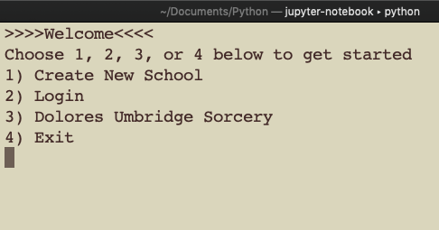
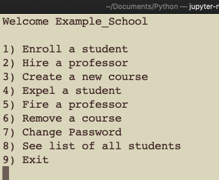
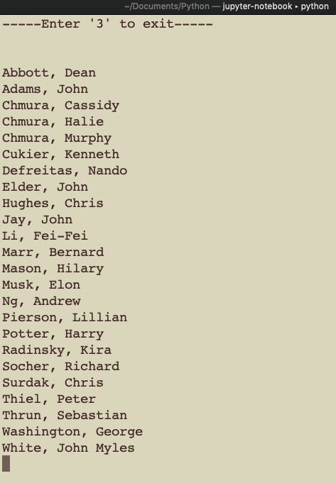

School system made using Python [via terminal nano]
---------------------------------------------------------------
**WIP**

Making a 'school system' with functionality such as creating a new school, logging in, creating & deleting students/professors/courses, etc.
Has a Harry Potter twist on it (I was making this while watching Harry Potter ;p)

**Professor Dolores' password:** I</3HarryPotter

**Login to Example_School-** **Username:** Example_School34 **Password:** password
Example_School cannot be deleted completely by Umbridge | You can expel/add students/professors, etc to Example_School though

To view project
---------------------------
- download zip
- navigate to downloaded folder using command line interface (terminal)
- to start project, use command: python start.py 
- note: you must have python installed

Screenshots
---------------------------------
Examples of different features of the school system

**Start Menu**

User has choice of creating a new school, logging into a past school, or acting as Professor Umbridge. Saves data in txt file to access during future use.

**School Menu**

User has options such as adding/deleting student/professor/course, seeing a list of all students/professors/courses, etc. Save data of each individual school using pickling

**List of students in example school**

Can see alphabetized list of all the students in a particular school. If user expels a student, student name disappears from this list.

